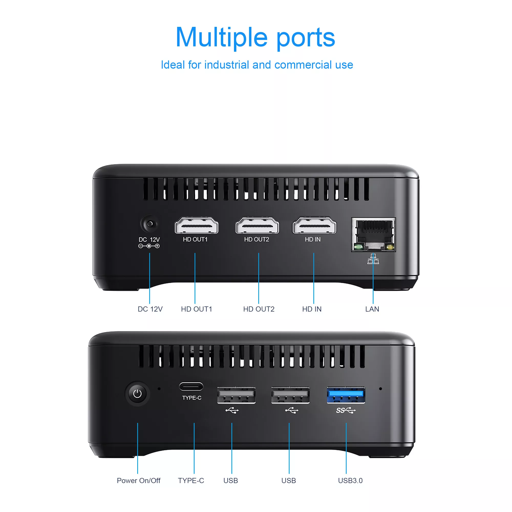
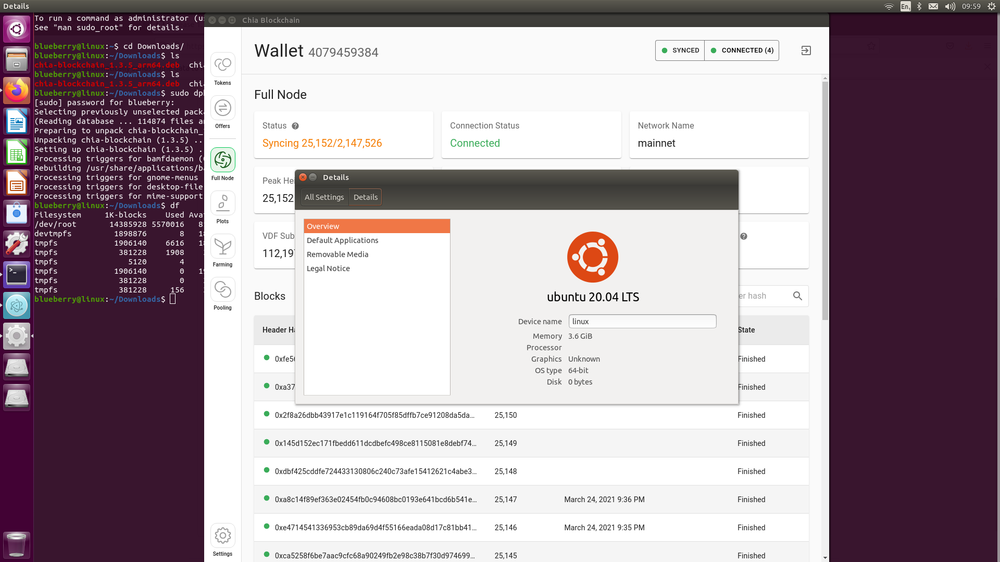
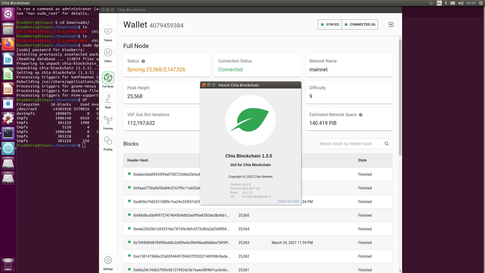

This is the documentation for Chia Hard Full Node Wallet, written by RSD Team of HYY Technology Co.,Ltd.

# Chia Hard Full Node Wallet
Chia Hard Full Node Wallet can sync to latest height. It makes you get full node wallet any time. And do not need long time syncing for full note when you want farming chia cions.

# Hardware

# Software
- OS: Ubuntu 20.04 64bit
    - 
- Wallet App: Chia Blockchain 1.3.5
    - 

# Full Node Data